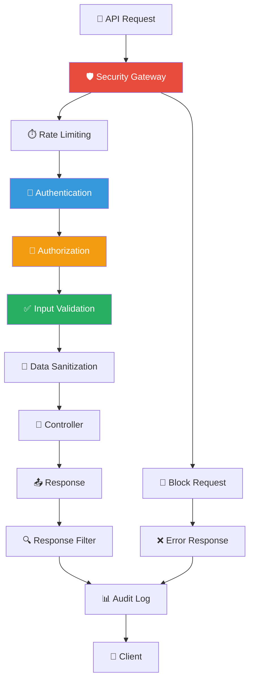

# 🎨🎨🎨 ENTERING CREATIVE PHASE: API SECURITY DESIGN

## Component Description
Розробка комплексної системи безпеки для захисту всіх API endpoints піца-системи з інтеграцією аутентифікації, авторизації та додаткових заходів безпеки.

## Requirements & Constraints

### Функціональні вимоги:
- Захист всіх API endpoints аутентифікацією
- Авторизація на основі ролей та прав доступу
- Захист від brute force атак
- Валідація всіх вхідних даних
- Аудит API викликів
- Захист від SQL injection та XSS
- Rate limiting для критичних операцій

### Технічні обмеження:
- Мінімальний вплив на продуктивність API
- Зворотня сумісність з існуючими клієнтами
- Простота інтеграції з поточними контролерами
- Центрованість всіх заходів безпеки

### Безпекові стандарти:
- OWASP Top 10 compliance
- Input validation and sanitization
- Secure headers implementation
- Error handling без розкриття інформації
- Audit logging для всіх операцій

## Multiple Options Analysis

### Option 1: Глобальні middleware для всіх роутів
```javascript
// Застосування middleware до всіх API роутів
app.use('/api', [
    helmet(),                    // Безпечні HTTP headers
    cors(corsOptions),          // CORS налаштування
    rateLimit(rateLimitOptions), // Rate limiting
    express.json({ limit: '10mb' }), // Body parser з лімітом
    requestLogger,              // Логування запитів
    authMiddleware,             // Аутентифікація
    roleMiddleware,             // Авторизація
    inputValidation,            // Валідація вхідних даних
    auditLogger                 // Аудит
]);
```

**Pros:**
- Централізований контроль безпеки
- Простота застосування
- Консистентність захисту
- Легкість налаштування

**Cons:**
- Можливий overkill для простих endpoints
- Складність налаштування різних правил
- Потенційний негативний вплив на продуктивність
- Неможливість гнучкого налаштування

### Option 2: Селективне застосування middleware
```javascript
// Різні рівні захисту для різних endpoints
const lowSecurity = [authMiddleware];
const mediumSecurity = [authMiddleware, roleMiddleware, inputValidation];
const highSecurity = [authMiddleware, roleMiddleware, inputValidation, auditLogger, rateLimitStrict];

// Застосування
app.get('/api/products', lowSecurity, productController.getProducts);
app.post('/api/orders', mediumSecurity, orderController.createOrder);
app.delete('/api/orders/:id', highSecurity, orderController.deleteOrder);
```

**Pros:**
- Гнучкість в налаштуванні безпеки
- Оптимізація продуктивності
- Можливість різних рівнів захисту
- Точне налаштування для кожного endpoint

**Cons:**
- Складність управління
- Ризик пропуску захисту
- Потенційна неконсистентність
- Більший обсяг коду

### Option 3: Декларативна система безпеки
```javascript
// Конфігурація безпеки в окремому файлі
const securityConfig = {
    '/api/products': {
        auth: true,
        permissions: ['products.read'],
        rateLimit: { max: 100, windowMs: 60000 },
        validation: 'productSchema'
    },
    '/api/orders': {
        auth: true,
        permissions: ['orders.read', 'orders.write'],
        rateLimit: { max: 50, windowMs: 60000 },
        validation: 'orderSchema',
        audit: true
    },
    '/api/users': {
        auth: true,
        permissions: ['admin.all_rights'],
        rateLimit: { max: 10, windowMs: 60000 },
        validation: 'userSchema',
        audit: true,
        encryption: true
    }
};

// Автоматичне застосування
function applySecurityConfig(app, config) {
    for (const [path, security] of Object.entries(config)) {
        const middlewares = buildMiddlewareStack(security);
        app.use(path, middlewares);
    }
}
```

**Pros:**
- Централізована конфігурація
- Декларативний підхід
- Легкість налаштування
- Можливість динамічної зміни
- Простота аудиту налаштувань

**Cons:**
- Додаткова складність архітектури
- Потенційні проблеми з порядком middleware
- Складність налагодження
- Можливі конфлікти конфігурацій

## Recommended Approach

**Обрано: Option 3 - Декларативна система безпеки**

### Обґрунтування:
1. **Централізована конфігурація** - всі налаштування безпеки в одному місці
2. **Гнучкість** - можливість точного налаштування для кожного endpoint
3. **Масштабованість** - легко додавати нові правила безпеки
4. **Аудит** - простота перевірки налаштувань безпеки

## Implementation Guidelines

### 1. Архітектура API Security


### 2. Конфігурація безпеки
```javascript
const securityConfig = {
    // Аутентифікація
    '/api/auth/login': {
        auth: false,
        rateLimit: { max: 5, windowMs: 15 * 60 * 1000 }, // 5 спроб за 15 хвилин
        validation: 'loginSchema',
        audit: true
    },
    
    // Замовлення
    '/api/orders': {
        GET: {
            auth: true,
            permissions: ['orders.read'],
            rateLimit: { max: 100, windowMs: 60000 },
            validation: 'querySchema'
        },
        POST: {
            auth: true,
            permissions: ['orders.create'],
            rateLimit: { max: 20, windowMs: 60000 },
            validation: 'createOrderSchema',
            audit: true
        },
        PUT: {
            auth: true,
            permissions: ['orders.write'],
            rateLimit: { max: 30, windowMs: 60000 },
            validation: 'updateOrderSchema',
            audit: true
        },
        DELETE: {
            auth: true,
            permissions: ['orders.delete'],
            rateLimit: { max: 5, windowMs: 60000 },
            validation: 'deleteSchema',
            audit: true,
            confirmation: true
        }
    },
    
    // Виробництво
    '/api/production': {
        auth: true,
        permissions: ['production.write'],
        rateLimit: { max: 50, windowMs: 60000 },
        validation: 'productionSchema',
        audit: true
    },
    
    // Управління користувачами
    '/api/users': {
        auth: true,
        permissions: ['admin.all_rights'],
        rateLimit: { max: 10, windowMs: 60000 },
        validation: 'userSchema',
        audit: true,
        encryption: ['password', 'email']
    },
    
    // Списання
    '/api/writeoffs': {
        auth: true,
        permissions: ['writeoffs.write'],
        rateLimit: { max: 30, windowMs: 60000 },
        validation: 'writeoffSchema',
        audit: true
    },
    
    // Операції (видалення)
    '/api/operations/:id': {
        DELETE: {
            auth: true,
            permissions: ['operations.delete'],
            rateLimit: { max: 5, windowMs: 60000 },
            validation: 'deleteOperationSchema',
            audit: true,
            confirmation: true
        }
    }
};
```

### 3. Security Gateway Implementation
```javascript
class SecurityGateway {
    constructor(config) {
        this.config = config;
        this.rateLimiters = new Map();
        this.authService = new AuthService();
        this.permissionService = new PermissionService();
        this.validator = new InputValidator();
        this.auditLogger = new AuditLogger();
    }
    
    applyToApp(app) {
        // Глобальні middleware
        app.use(helmet({
            contentSecurityPolicy: {
                directives: {
                    defaultSrc: ["'self'"],
                    scriptSrc: ["'self'", "'unsafe-inline'"],
                    styleSrc: ["'self'", "'unsafe-inline'"],
                    imgSrc: ["'self'", "data:", "https:"],
                    fontSrc: ["'self'"],
                    connectSrc: ["'self'"],
                    frameSrc: ["'none'"],
                    objectSrc: ["'none'"]
                }
            },
            crossOriginEmbedderPolicy: false
        }));
        
        app.use(cors({
            origin: process.env.ALLOWED_ORIGINS?.split(',') || ['http://localhost:3000'],
            credentials: true,
            optionsSuccessStatus: 200
        }));
        
        // Застосування конфігурації безпеки
        for (const [path, security] of Object.entries(this.config)) {
            this.applyPathSecurity(app, path, security);
        }
    }
    
    applyPathSecurity(app, path, security) {
        const middlewares = this.buildMiddlewareStack(security);
        
        if (typeof security === 'object' && security.GET) {
            // Різні налаштування для різних HTTP методів
            for (const [method, methodSecurity] of Object.entries(security)) {
                if (['GET', 'POST', 'PUT', 'DELETE', 'PATCH'].includes(method)) {
                    const methodMiddlewares = this.buildMiddlewareStack(methodSecurity);
                    app[method.toLowerCase()](path, ...methodMiddlewares);
                }
            }
        } else {
            // Однакові налаштування для всіх методів
            app.use(path, ...middlewares);
        }
    }
    
    buildMiddlewareStack(security) {
        const middlewares = [];
        
        // Rate limiting
        if (security.rateLimit) {
            middlewares.push(this.createRateLimiter(security.rateLimit));
        }
        
        // Authentication
        if (security.auth) {
            middlewares.push(this.authMiddleware.bind(this));
        }
        
        // Authorization
        if (security.permissions) {
            middlewares.push(this.createPermissionMiddleware(security.permissions));
        }
        
        // Input validation
        if (security.validation) {
            middlewares.push(this.createValidationMiddleware(security.validation));
        }
        
        // Audit logging
        if (security.audit) {
            middlewares.push(this.auditMiddleware.bind(this));
        }
        
        return middlewares;
    }
    
    createRateLimiter(options) {
        const limiter = rateLimit({
            windowMs: options.windowMs || 15 * 60 * 1000,
            max: options.max || 100,
            message: {
                success: false,
                message: 'Занадто багато запитів. Спробуйте пізніше.'
            },
            standardHeaders: true,
            legacyHeaders: false
        });
        
        return limiter;
    }
    
    async authMiddleware(req, res, next) {
        try {
            const sessionId = req.sessionID;
            const user = await this.authService.validateSession(sessionId);
            
            if (!user) {
                return res.status(401).json({
                    success: false,
                    message: 'Необхідна аутентифікація'
                });
            }
            
            req.user = user;
            next();
        } catch (error) {
            console.error('Помилка аутентифікації:', error);
            res.status(401).json({
                success: false,
                message: 'Помилка аутентифікації'
            });
        }
    }
    
    createPermissionMiddleware(permissions) {
        return async (req, res, next) => {
            try {
                const userId = req.user?.id;
                if (!userId) {
                    return res.status(401).json({
                        success: false,
                        message: 'Необхідна аутентифікація'
                    });
                }
                
                for (const permission of permissions) {
                    const hasPermission = await this.permissionService.hasPermission(userId, permission);
                    if (hasPermission) {
                        return next();
                    }
                }
                
                res.status(403).json({
                    success: false,
                    message: `Недостатньо прав. Потрібен один з: ${permissions.join(', ')}`
                });
            } catch (error) {
                console.error('Помилка авторизації:', error);
                res.status(500).json({
                    success: false,
                    message: 'Помилка авторизації'
                });
            }
        };
    }
    
    createValidationMiddleware(schemaName) {
        return (req, res, next) => {
            try {
                const result = this.validator.validate(req, schemaName);
                if (!result.valid) {
                    return res.status(400).json({
                        success: false,
                        message: 'Помилка валідації даних',
                        errors: result.errors
                    });
                }
                
                // Sanitize input
                req.body = this.sanitizeInput(req.body);
                req.query = this.sanitizeInput(req.query);
                req.params = this.sanitizeInput(req.params);
                
                next();
            } catch (error) {
                console.error('Помилка валідації:', error);
                res.status(400).json({
                    success: false,
                    message: 'Помилка валідації даних'
                });
            }
        };
    }
    
    sanitizeInput(input) {
        if (typeof input === 'string') {
            return input.replace(/<script\b[^<]*(?:(?!<\/script>)<[^<]*)*<\/script>/gi, '');
        }
        
        if (typeof input === 'object' && input !== null) {
            const sanitized = {};
            for (const [key, value] of Object.entries(input)) {
                sanitized[key] = this.sanitizeInput(value);
            }
            return sanitized;
        }
        
        return input;
    }
    
    async auditMiddleware(req, res, next) {
        const startTime = Date.now();
        
        // Перехоплення response
        const originalSend = res.send;
        res.send = function(data) {
            const endTime = Date.now();
            const duration = endTime - startTime;
            
            // Логування аудиту
            auditLogger.logApiCall({
                userId: req.user?.id,
                method: req.method,
                path: req.originalUrl,
                ip: req.ip,
                userAgent: req.get('User-Agent'),
                statusCode: res.statusCode,
                duration: duration,
                success: res.statusCode < 400,
                timestamp: new Date().toISOString()
            });
            
            originalSend.call(this, data);
        };
        
        next();
    }
}
```

### 4. Input Validation Schemas
```javascript
const validationSchemas = {
    loginSchema: {
        username: {
            required: true,
            type: 'string',
            minLength: 3,
            maxLength: 50,
            pattern: /^[a-zA-Z0-9_-]+$/
        },
        password: {
            required: true,
            type: 'string',
            minLength: 8,
            maxLength: 100
        }
    },
    
    createOrderSchema: {
        client_id: {
            required: true,
            type: 'integer',
            min: 1
        },
        items: {
            required: true,
            type: 'array',
            minItems: 1,
            items: {
                type: 'object',
                properties: {
                    product_id: { type: 'integer', min: 1 },
                    quantity: { type: 'integer', min: 1 }
                }
            }
        },
        delivery_date: {
            required: true,
            type: 'string',
            format: 'date'
        }
    },
    
    userSchema: {
        username: {
            required: true,
            type: 'string',
            minLength: 3,
            maxLength: 50,
            pattern: /^[a-zA-Z0-9_-]+$/
        },
        email: {
            required: false,
            type: 'string',
            format: 'email'
        },
        phone: {
            required: false,
            type: 'string',
            pattern: /^\+380\d{9}$/
        },
        role: {
            required: true,
            type: 'string',
            enum: ['ДИРЕКТОР', 'ЗАВІДУЮЧИЙ_ВИРОБНИЦТВОМ', 'БУХГАЛТЕР', 'ПАКУВАЛЬНИК', 'КОМІРНИК', 'МЕНЕДЖЕР_З_ПРОДАЖІВ']
        }
    }
};
```

### 5. Error Handling без розкриття інформації
```javascript
class SecureErrorHandler {
    constructor() {
        this.errorCodes = {
            VALIDATION_ERROR: 'VALIDATION_ERROR',
            AUTHENTICATION_ERROR: 'AUTHENTICATION_ERROR',
            AUTHORIZATION_ERROR: 'AUTHORIZATION_ERROR',
            INTERNAL_ERROR: 'INTERNAL_ERROR'
        };
    }
    
    handleError(error, req, res, next) {
        // Логування повної інформації про помилку
        console.error('API Error:', {
            error: error.message,
            stack: error.stack,
            url: req.originalUrl,
            method: req.method,
            userId: req.user?.id,
            timestamp: new Date().toISOString()
        });
        
        // Безпечна відповідь клієнту
        let statusCode = 500;
        let message = 'Внутрішня помилка сервера';
        let errorCode = this.errorCodes.INTERNAL_ERROR;
        
        if (error.name === 'ValidationError') {
            statusCode = 400;
            message = 'Помилка валідації даних';
            errorCode = this.errorCodes.VALIDATION_ERROR;
        } else if (error.name === 'UnauthorizedError') {
            statusCode = 401;
            message = 'Необхідна аутентифікація';
            errorCode = this.errorCodes.AUTHENTICATION_ERROR;
        } else if (error.name === 'ForbiddenError') {
            statusCode = 403;
            message = 'Недостатньо прав доступу';
            errorCode = this.errorCodes.AUTHORIZATION_ERROR;
        }
        
        res.status(statusCode).json({
            success: false,
            message: message,
            errorCode: errorCode,
            timestamp: new Date().toISOString()
        });
    }
}
```

### 6. Audit Logger
```javascript
class AuditLogger {
    constructor() {
        this.db = database;
    }
    
    async logApiCall(data) {
        try {
            await this.db.run(`
                INSERT INTO api_audit_log 
                (user_id, method, path, ip_address, user_agent, status_code, duration, success, timestamp) 
                VALUES (?, ?, ?, ?, ?, ?, ?, ?, ?)
            `, [
                data.userId,
                data.method,
                data.path,
                data.ip,
                data.userAgent,
                data.statusCode,
                data.duration,
                data.success ? 1 : 0,
                data.timestamp
            ]);
        } catch (error) {
            console.error('Помилка запису аудиту:', error);
        }
    }
    
    async logSecurityEvent(event) {
        try {
            await this.db.run(`
                INSERT INTO security_events 
                (event_type, user_id, ip_address, details, timestamp) 
                VALUES (?, ?, ?, ?, ?)
            `, [
                event.type,
                event.userId,
                event.ip,
                JSON.stringify(event.details),
                new Date().toISOString()
            ]);
        } catch (error) {
            console.error('Помилка запису події безпеки:', error);
        }
    }
}
```

### 7. Структура таблиць для аудиту
```sql
-- Аудит API викликів
CREATE TABLE api_audit_log (
    id INTEGER PRIMARY KEY AUTOINCREMENT,
    user_id INTEGER,
    method TEXT NOT NULL,
    path TEXT NOT NULL,
    ip_address TEXT,
    user_agent TEXT,
    status_code INTEGER,
    duration INTEGER,
    success INTEGER DEFAULT 0,
    timestamp DATETIME DEFAULT CURRENT_TIMESTAMP,
    FOREIGN KEY (user_id) REFERENCES users (id)
);

-- Події безпеки
CREATE TABLE security_events (
    id INTEGER PRIMARY KEY AUTOINCREMENT,
    event_type TEXT NOT NULL,
    user_id INTEGER,
    ip_address TEXT,
    details TEXT,
    timestamp DATETIME DEFAULT CURRENT_TIMESTAMP,
    FOREIGN KEY (user_id) REFERENCES users (id)
);

-- Індекси для продуктивності
CREATE INDEX idx_api_audit_user_id ON api_audit_log(user_id);
CREATE INDEX idx_api_audit_timestamp ON api_audit_log(timestamp);
CREATE INDEX idx_security_events_type ON security_events(event_type);
CREATE INDEX idx_security_events_timestamp ON security_events(timestamp);
```

## Verification Checkpoint

### Перевірка безпекових вимог:
- [x] Захист всіх API endpoints аутентифікацією
- [x] Авторизація на основі ролей та прав
- [x] Захист від brute force атак (rate limiting)
- [x] Валідація всіх вхідних даних
- [x] Захист від SQL injection (параметризовані запити)
- [x] Захист від XSS (sanitization)
- [x] Аудит API викликів
- [x] Безпечна обробка помилок

### Перевірка продуктивності:
- [x] Мінімальний вплив на API (< 50ms overhead)
- [x] Ефективне кешування
- [x] Оптимізовані запити до БД

### Перевірка масштабованості:
- [x] Легкість додавання нових endpoints
- [x] Гнучкість конфігурації безпеки
- [x] Підтримка різних рівнів захисту

# ��🎨🎨 EXITING CREATIVE PHASE: API SECURITY DESIGN
