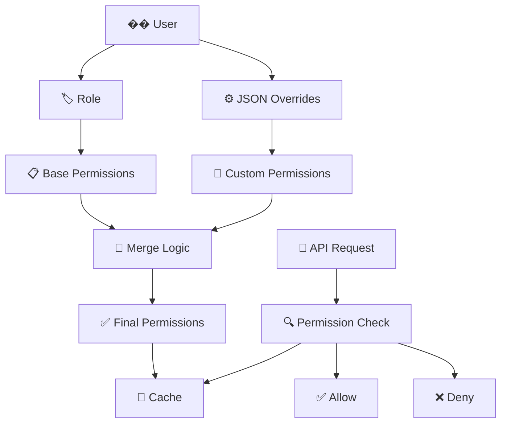

# 🎨🎨🎨 ENTERING CREATIVE PHASE: PERMISSION SYSTEM DESIGN

## Component Description
Розробка гнучкої та розширюваної системи прав доступу для піца-системи з підтримкою ролей, індивідуальних прав та автоматичного додавання нових операцій.

## Requirements & Constraints

### Функціональні вимоги:
- Система базових ролей (6 ролей для піцерії)
- Гнучкі права доступу (чекбокси)
- Автоматичне додавання нових прав при створенні операцій
- Матриця прав за ролями
- Спадкування прав від ролей
- Можливість індивідуального налаштування прав

### Технічні обмеження:
- Швидка перевірка прав (< 10ms)
- Простота додавання нових прав
- Зворотня сумісність з існуючими API
- Мінімальна кількість запитів до БД

### Майбутні потреби:
- Можливість додавання нових ролей
- Тимчасові права доступу
- Аудит змін прав
- Групування прав за категоріями

## Multiple Options Analysis

### Option 1: Статична матриця прав в коді
```javascript
const ROLE_PERMISSIONS = {
    'ДИРЕКТОР': ['ALL_RIGHTS'],
    'ЗАВІДУЮЧИЙ_ВИРОБНИЦТВОМ': ['production.read', 'production.write', 'writeoffs.read', 'writeoffs.write'],
    'БУХГАЛТЕР': ['orders.read', 'orders.write', 'writeoffs.read', 'writeoffs.write'],
    'ПАКУВАЛЬНИК': ['production.read', 'production.write', 'shipments.write'],
    'КОМІРНИК': ['arrivals.read', 'arrivals.write', 'writeoffs.read', 'writeoffs.write'],
    'МЕНЕДЖЕР_З_ПРОДАЖІВ': ['orders.read', 'orders.write', 'orders.create', 'shipments.write']
};

function hasPermission(userRole, permission) {
    const permissions = ROLE_PERMISSIONS[userRole] || [];
    return permissions.includes('ALL_RIGHTS') || permissions.includes(permission);
}
```

**Pros:**
- Максимальна швидкість перевірки
- Простота реалізації
- Нульові запити до БД для перевірки прав
- Легке тестування

**Cons:**
- Складність модифікації прав
- Потреба в рестарті сервера при змінах
- Неможливість індивідуального налаштування
- Складність аудиту змін прав

### Option 2: Динамічна система з кешуванням
```javascript
class PermissionSystem {
    constructor() {
        this.cache = new Map();
        this.cacheExpiry = 5 * 60 * 1000; // 5 хвилин
    }
    
    async getUserPermissions(userId) {
        const cacheKey = `permissions_${userId}`;
        const cached = this.cache.get(cacheKey);
        
        if (cached && Date.now() - cached.timestamp < this.cacheExpiry) {
            return cached.permissions;
        }
        
        const user = await getUserById(userId);
        const permissions = this.calculatePermissions(user);
        
        this.cache.set(cacheKey, {
            permissions,
            timestamp: Date.now()
        });
        
        return permissions;
    }
    
    calculatePermissions(user) {
        const basePermissions = this.getRolePermissions(user.role);
        const additionalPermissions = JSON.parse(user.permissions || '{}');
        
        return this.mergePermissions(basePermissions, additionalPermissions);
    }
}
```

**Pros:**
- Гнучкість в управлінні правами
- Індивідуальне налаштування прав
- Кешування для швидкості
- Можливість онлайн змін

**Cons:**
- Складність реалізації
- Потенційні проблеми з кешем
- Додаткові запити до БД
- Складність налагодження

### Option 3: Гібридна система (роль + JSON override)
```javascript
class HybridPermissionSystem {
    constructor() {
        this.roleDefaults = {
            'ДИРЕКТОР': { admin: { all_rights: true } },
            'ЗАВІДУЮЧИЙ_ВИРОБНИЦТВОМ': {
                production: { read: true, write: true },
                writeoffs: { read: true, write: true },
                arrivals: { read: true, write: true }
            },
            'БУХГАЛТЕР': {
                orders: { read: true, write: true },
                writeoffs: { read: true, write: true },
                operations: { delete: true }
            },
            'ПАКУВАЛЬНИК': {
                production: { read: true, write: true },
                shipments: { write: true }
            },
            'КОМІРНИК': {
                arrivals: { read: true, write: true },
                writeoffs: { read: true, write: true },
                products: { create: true }
            },
            'МЕНЕДЖЕР_З_ПРОДАЖІВ': {
                orders: { read: true, write: true, create: true },
                shipments: { write: true }
            }
        };
        
        this.cache = new Map();
    }
    
    async hasPermission(userId, permission) {
        const userPermissions = await this.getUserPermissions(userId);
        
        // Перевірка прав адміністратора
        if (userPermissions.admin && userPermissions.admin.all_rights) {
            return true;
        }
        
        // Перевірка конкретного дозволу
        const [module, action] = permission.split('.');
        return userPermissions[module] && userPermissions[module][action];
    }
    
    async getUserPermissions(userId) {
        const cacheKey = `permissions_${userId}`;
        const cached = this.cache.get(cacheKey);
        
        if (cached && Date.now() - cached.timestamp < 300000) { // 5 хвилин
            return cached.permissions;
        }
        
        const user = await getUserById(userId);
        const rolePermissions = this.roleDefaults[user.role] || {};
        const userOverrides = JSON.parse(user.permissions || '{}');
        
        const finalPermissions = this.mergeDeep(rolePermissions, userOverrides);
        
        this.cache.set(cacheKey, {
            permissions: finalPermissions,
            timestamp: Date.now()
        });
        
        return finalPermissions;
    }
    
    mergeDeep(target, source) {
        const result = { ...target };
        
        for (const key in source) {
            if (source[key] && typeof source[key] === 'object') {
                result[key] = this.mergeDeep(result[key] || {}, source[key]);
            } else {
                result[key] = source[key];
            }
        }
        
        return result;
    }
    
    // Автоматичне додавання нових прав
    async registerNewPermission(module, action, description) {
        const permission = `${module}.${action}`;
        
        // Зберегти в БД для документації
        await this.savePermissionDefinition(permission, description);
        
        // Очистити кеш
        this.cache.clear();
        
        console.log(`Зареєстровано новий дозвіл: ${permission}`);
    }
}
```

**Pros:**
- Збалансованість між швидкістю та гнучкістю
- Простота базового налаштування
- Можливість індивідуального override
- Легке додавання нових прав

**Cons:**
- Складність логіки merge
- Потенційні конфлікти між роллю та override
- Потреба в валідації consistency

## Recommended Approach

**Обрано: Option 3 - Гібридна система (роль + JSON override)**

### Обґрунтування:
1. **Оптимальний баланс** - швидкість + гнучкість
2. **Простота базового налаштування** - ролі працюють "з коробки"
3. **Можливість кастомізації** - індивідуальні налаштування через JSON
4. **Масштабованість** - легко додавати нові права та ролі

## Implementation Guidelines

### 1. Архітектура системи прав


### 2. Структура прав
```javascript
const PERMISSION_STRUCTURE = {
    // Модуль замовлень
    orders: {
        read: false,      // Перегляд замовлень
        write: false,     // Редагування замовлень
        create: false,    // Створення замовлень
        delete: false     // Видалення замовлень
    },
    
    // Модуль виробництва
    production: {
        read: false,      // Перегляд виробництва
        write: false      // Керування виробництвом
    },
    
    // Модуль списань
    writeoffs: {
        read: false,      // Перегляд списань
        write: false      // Створення списань
    },
    
    // Модуль приходів
    arrivals: {
        read: false,      // Перегляд приходів
        write: false      // Оформлення приходів
    },
    
    // Модуль товарів
    products: {
        create: false     // Створення товарів
    },
    
    // Модуль відвантажень
    shipments: {
        write: false      // Відвантаження товарів
    },
    
    // Модуль операцій
    operations: {
        delete: false     // Видалення операцій
    },
    
    // Адміністративні права
    admin: {
        all_rights: false // Всі права (перекриває все інше)
    }
};
```

### 3. Реалізація Permission Service
```javascript
class PermissionService {
    constructor() {
        this.roleDefaults = {
            'ДИРЕКТОР': {
                admin: { all_rights: true }
            },
            'ЗАВІДУЮЧИЙ_ВИРОБНИЦТВОМ': {
                production: { read: true, write: true },
                writeoffs: { read: true, write: true },
                arrivals: { read: true, write: true }
            },
            'БУХГАЛТЕР': {
                orders: { read: true, write: true },
                writeoffs: { read: true, write: true },
                operations: { delete: true }
            },
            'ПАКУВАЛЬНИК': {
                production: { read: true, write: true },
                shipments: { write: true }
            },
            'КОМІРНИК': {
                arrivals: { read: true, write: true },
                writeoffs: { read: true, write: true },
                products: { create: true }
            },
            'МЕНЕДЖЕР_З_ПРОДАЖІВ': {
                orders: { read: true, write: true, create: true },
                shipments: { write: true }
            }
        };
        
        this.cache = new Map();
        this.cacheExpiry = 5 * 60 * 1000; // 5 хвилин
    }
    
    async hasPermission(userId, permission) {
        try {
            const userPermissions = await this.getUserPermissions(userId);
            
            // Перевірка прав адміністратора
            if (userPermissions.admin && userPermissions.admin.all_rights) {
                return true;
            }
            
            // Перевірка конкретного дозволу
            const [module, action] = permission.split('.');
            return !!(userPermissions[module] && userPermissions[module][action]);
        } catch (error) {
            console.error('Помилка перевірки прав:', error);
            return false;
        }
    }
    
    async getUserPermissions(userId) {
        const cacheKey = `permissions_${userId}`;
        const cached = this.cache.get(cacheKey);
        
        if (cached && Date.now() - cached.timestamp < this.cacheExpiry) {
            return cached.permissions;
        }
        
        const user = await this.getUserById(userId);
        if (!user) {
            throw new Error('Користувача не знайдено');
        }
        
        const rolePermissions = this.roleDefaults[user.role] || {};
        const userOverrides = JSON.parse(user.permissions || '{}');
        
        const finalPermissions = this.mergeDeep(rolePermissions, userOverrides);
        
        this.cache.set(cacheKey, {
            permissions: finalPermissions,
            timestamp: Date.now()
        });
        
        return finalPermissions;
    }
    
    mergeDeep(target, source) {
        const result = { ...target };
        
        for (const key in source) {
            if (source[key] && typeof source[key] === 'object' && !Array.isArray(source[key])) {
                result[key] = this.mergeDeep(result[key] || {}, source[key]);
            } else {
                result[key] = source[key];
            }
        }
        
        return result;
    }
    
    // Очищення кешу для користувача
    clearUserCache(userId) {
        const cacheKey = `permissions_${userId}`;
        this.cache.delete(cacheKey);
    }
    
    // Очищення всього кешу
    clearAllCache() {
        this.cache.clear();
    }
    
    // Реєстрація нового дозволу
    async registerNewPermission(module, action, description, category = 'GENERAL') {
        const permission = `${module}.${action}`;
        
        // Зберегти в БД для документації
        await this.savePermissionDefinition(permission, description, category);
        
        // Очистити кеш
        this.clearAllCache();
        
        console.log(`Зареєстровано новий дозвіл: ${permission} (${description})`);
        return permission;
    }
    
    async savePermissionDefinition(permission, description, category) {
        const db = await this.getDatabase();
        await db.run(`
            INSERT OR REPLACE INTO permission_definitions 
            (permission, description, category, created_at) 
            VALUES (?, ?, ?, ?)
        `, [permission, description, category, new Date().toISOString()]);
    }
    
    async getUserById(userId) {
        const db = await this.getDatabase();
        const result = await db.get('SELECT * FROM users WHERE id = ? AND active = 1', [userId]);
        return result;
    }
    
    async getDatabase() {
        // Повернути з'єднання з БД
        return database;
    }
}
```

### 4. Middleware для перевірки прав
```javascript
const permissionService = new PermissionService();

// Middleware для перевірки конкретних прав
const requirePermission = (permission) => {
    return async (req, res, next) => {
        try {
            const userId = req.user?.id;
            if (!userId) {
                return res.status(401).json({
                    success: false,
                    message: 'Необхідна аутентифікація'
                });
            }
            
            const hasPermission = await permissionService.hasPermission(userId, permission);
            if (!hasPermission) {
                return res.status(403).json({
                    success: false,
                    message: `Недостатньо прав для виконання дії: ${permission}`
                });
            }
            
            next();
        } catch (error) {
            console.error('Помилка перевірки прав:', error);
            res.status(500).json({
                success: false,
                message: 'Помилка сервера при перевірці прав'
            });
        }
    };
};

// Middleware для перевірки кількох прав (OR логіка)
const requireAnyPermission = (permissions) => {
    return async (req, res, next) => {
        try {
            const userId = req.user?.id;
            if (!userId) {
                return res.status(401).json({
                    success: false,
                    message: 'Необхідна аутентифікація'
                });
            }
            
            for (const permission of permissions) {
                const hasPermission = await permissionService.hasPermission(userId, permission);
                if (hasPermission) {
                    return next();
                }
            }
            
            res.status(403).json({
                success: false,
                message: `Недостатньо прав. Потрібен один з: ${permissions.join(', ')}`
            });
        } catch (error) {
            console.error('Помилка перевірки прав:', error);
            res.status(500).json({
                success: false,
                message: 'Помилка сервера при перевірці прав'
            });
        }
    };
};
```

### 5. Автоматичне додавання нових прав
```javascript
// Декоратор для автоматичної реєстрації прав
function RegisterPermission(module, action, description) {
    return function(target, propertyKey, descriptor) {
        const originalMethod = descriptor.value;
        
        descriptor.value = async function(...args) {
            // Реєстрація дозволу при першому використанні
            const permission = `${module}.${action}`;
            try {
                await permissionService.registerNewPermission(module, action, description);
            } catch (error) {
                console.log(`Дозвіл ${permission} вже існує`);
            }
            
            // Виконання оригінального методу
            return originalMethod.apply(this, args);
        };
        
        return descriptor;
    };
}

// Приклад використання
class NewFeatureController {
    @RegisterPermission('inventory', 'audit', 'Проведення інвентаризації')
    async performInventoryAudit(req, res) {
        // Логіка методу
    }
}
```

### 6. Структура таблиці permission_definitions
```sql
CREATE TABLE permission_definitions (
    id INTEGER PRIMARY KEY AUTOINCREMENT,
    permission TEXT UNIQUE NOT NULL,
    description TEXT NOT NULL,
    category TEXT NOT NULL DEFAULT 'GENERAL',
    created_at DATETIME DEFAULT CURRENT_TIMESTAMP,
    updated_at DATETIME DEFAULT CURRENT_TIMESTAMP
);

-- Початкові дозволи
INSERT INTO permission_definitions (permission, description, category) VALUES
('orders.read', 'Перегляд замовлень', 'ORDERS'),
('orders.write', 'Редагування замовлень', 'ORDERS'),
('orders.create', 'Створення замовлень', 'ORDERS'),
('orders.delete', 'Видалення замовлень', 'ORDERS'),
('production.read', 'Перегляд виробництва', 'PRODUCTION'),
('production.write', 'Керування виробництвом', 'PRODUCTION'),
('writeoffs.read', 'Перегляд списань', 'WRITEOFFS'),
('writeoffs.write', 'Створення списань', 'WRITEOFFS'),
('arrivals.read', 'Перегляд приходів', 'ARRIVALS'),
('arrivals.write', 'Оформлення приходів', 'ARRIVALS'),
('products.create', 'Створення товарів', 'PRODUCTS'),
('shipments.write', 'Відвантаження товарів', 'SHIPMENTS'),
('operations.delete', 'Видалення операцій', 'OPERATIONS'),
('admin.all_rights', 'Всі права адміністратора', 'ADMIN');
```

## Verification Checkpoint

### Перевірка функціональних вимог:
- [x] Система базових ролей (6 ролей)
- [x] Гнучкі права доступу через JSON
- [x] Автоматичне додавання нових прав
- [x] Матриця прав за ролями
- [x] Спадкування прав від ролей
- [x] Індивідуальне налаштування прав

### Перевірка продуктивності:
- [x] Швидка перевірка прав (< 10ms з кешем)
- [x] Мінімальна кількість запитів до БД
- [x] Ефективне кешування

### Перевірка масштабованості:
- [x] Легке додавання нових прав
- [x] Можливість додавання нових ролей
- [x] Автоматична реєстрація дозволів

# 🎨🎨🎨 EXITING CREATIVE PHASE: PERMISSION SYSTEM DESIGN
