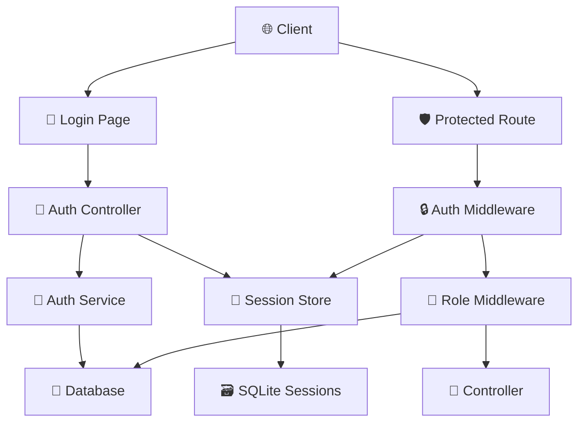

# 🎨🎨🎨 ENTERING CREATIVE PHASE: SECURITY ARCHITECTURE

## Component Description
Розробка архітектури безпеки для системи аутентифікації та авторизації користувачів піца-системи з підтримкою ролей, сесій та захисту API.

## Requirements & Constraints

### Функціональні вимоги:
- Безпечна аутентифікація (логін/пароль)
- Управління сесіями між рестартами сервера
- Авторизація на основі ролей та прав
- Захист всіх API endpoints
- Аудит дій користувачів
- Першочергове створення пароля

### Технічні обмеження:
- Використання Express.js framework
- Збереження сесій в SQLite
- Мінімальний вплив на продуктивність
- Зворотня сумісність з існуючими API

### Безпекові вимоги:
- Захист від SQL injection
- Захист від brute force атак
- Безпечне зберігання паролів
- Захист від session hijacking
- CSRF protection

## Multiple Options Analysis

### Option 1: Session-based Authentication з Express-session
```javascript
// Конфігурація
app.use(session({
  secret: process.env.SESSION_SECRET,
  resave: false,
  saveUninitialized: false,
  store: new SQLiteStore({
    db: 'sessions.db',
    table: 'user_sessions'
  }),
  cookie: {
    secure: process.env.NODE_ENV === 'production',
    httpOnly: true,
    maxAge: 24 * 60 * 60 * 1000 // 24 години
  }
}));
```

**Pros:**
- Простота реалізації
- Добра підтримка в Express
- Автоматичне управління сесіями
- Інтеграція з SQLite
- Добра безпека для server-side додатків

**Cons:**
- Сесії прив'язані до сервера
- Складність масштабування
- Залежність від cookies
- Потенційна уразливість до CSRF

### Option 2: JWT-based Authentication
```javascript
// Генерація токена
const token = jwt.sign(
  { userId: user.id, role: user.role, permissions: user.permissions },
  process.env.JWT_SECRET,
  { expiresIn: '24h' }
);

// Перевірка токена
const authMiddleware = (req, res, next) => {
  const token = req.headers.authorization?.split(' ')[1];
  try {
    const decoded = jwt.verify(token, process.env.JWT_SECRET);
    req.user = decoded;
    next();
  } catch (error) {
    res.status(401).json({ success: false, message: 'Unauthorized' });
  }
};
```

**Pros:**
- Stateless архітектура
- Добра масштабованість
- Підтримка мікросервісів
- Не залежить від cookies

**Cons:**
- Складність інвалідації токенів
- Безпека залежить від secret
- Потенційно великий розмір токена
- Складність refresh логіки

### Option 3: Гібридний підхід (Session + JWT для API)
```javascript
// Сесії для веб-інтерфейсу
app.use('/admin', session({...}));

// JWT для API
app.use('/api', jwtAuthMiddleware);

// Middleware для обох типів
const authMiddleware = (req, res, next) => {
  if (req.session && req.session.user) {
    req.user = req.session.user;
    return next();
  }
  
  const token = req.headers.authorization?.split(' ')[1];
  if (token) {
    try {
      req.user = jwt.verify(token, process.env.JWT_SECRET);
      return next();
    } catch (error) {
      // continue to unauthorized
    }
  }
  
  res.status(401).json({ success: false, message: 'Unauthorized' });
};
```

**Pros:**
- Гнучкість для різних клієнтів
- Оптимізація для веб та API
- Можливість поетапного впровадження

**Cons:**
- Складність архітектури
- Подвійна логіка аутентифікації
- Потенційні проблеми безпеки

## Recommended Approach

**Обрано: Option 1 - Session-based Authentication з Express-session**

### Обґрунтування:
1. **Простота реалізації** - мінімальні зміни в поточній архітектурі
2. **Безпека** - добре підходить для server-side додатків
3. **Інтеграція** - легко інтегрується з SQLite
4. **Зворотня сумісність** - не змінює існуючі API інтерфейси

## Implementation Guidelines

### 1. Архітектура безпеки


### 2. Middleware Architecture
```javascript
// Ланцюжок middleware для захисту
app.use('/api/protected', [
  authMiddleware,          // Перевірка аутентифікації
  roleMiddleware,          // Перевірка ролей
  permissionMiddleware,    // Перевірка конкретних прав
  rateLimitMiddleware      // Захист від brute force
]);
```

### 3. Компоненти безпеки

#### A. Authentication Service
```javascript
class AuthService {
  async login(username, password) {
    // 1. Валідація даних
    // 2. Пошук користувача
    // 3. Перевірка пароля (bcrypt)
    // 4. Створення сесії
    // 5. Логування входу
  }
  
  async logout(sessionId) {
    // 1. Видалення сесії
    // 2. Логування виходу
  }
  
  async validateSession(sessionId) {
    // 1. Перевірка існування сесії
    // 2. Перевірка терміну дії
    // 3. Оновлення last_activity
  }
}
```

#### B. Auth Middleware
```javascript
const authMiddleware = async (req, res, next) => {
  try {
    // 1. Перевірка сесії
    if (!req.session || !req.session.user) {
      return res.status(401).json({
        success: false,
        message: 'Необхідна аутентифікація'
      });
    }
    
    // 2. Перевірка активності користувача
    const user = await getUserById(req.session.user.id);
    if (!user || !user.active) {
      req.session.destroy();
      return res.status(401).json({
        success: false,
        message: 'Користувач неактивний'
      });
    }
    
    // 3. Оновлення інформації про користувача
    req.user = user;
    next();
  } catch (error) {
    res.status(500).json({
      success: false,
      message: 'Помилка аутентифікації'
    });
  }
};
```

#### C. Role Middleware
```javascript
const roleMiddleware = (requiredPermissions) => {
  return async (req, res, next) => {
    try {
      const user = req.user;
      const permissions = JSON.parse(user.permissions || '{}');
      
      // Перевірка прав адміністратора
      if (permissions.admin && permissions.admin.all_rights) {
        return next();
      }
      
      // Перевірка конкретних прав
      for (const permission of requiredPermissions) {
        if (!checkPermission(permissions, permission)) {
          return res.status(403).json({
            success: false,
            message: `Недостатньо прав: ${permission}`
          });
        }
      }
      
      next();
    } catch (error) {
      res.status(500).json({
        success: false,
        message: 'Помилка перевірки прав'
      });
    }
  };
};
```

### 4. Конфігурація безпеки
```javascript
// Session configuration
const sessionConfig = {
  secret: process.env.SESSION_SECRET || 'your-secret-key',
  resave: false,
  saveUninitialized: false,
  store: new SQLiteStore({
    db: './database.db',
    table: 'user_sessions',
    ttl: 24 * 60 * 60 * 1000, // 24 години
    cleanupInterval: 60 * 60 * 1000 // Очищення кожну годину
  }),
  cookie: {
    secure: process.env.NODE_ENV === 'production',
    httpOnly: true,
    maxAge: 24 * 60 * 60 * 1000, // 24 години
    sameSite: 'strict'
  }
};

// Rate limiting
const loginRateLimit = rateLimit({
  windowMs: 15 * 60 * 1000, // 15 хвилин
  max: 5, // максимум 5 спроб
  message: {
    success: false,
    message: 'Занадто багато спроб входу. Спробуйте пізніше.'
  }
});
```

### 5. Захист API endpoints
```javascript
// Мапа прав для кожного endpoint
const endpointPermissions = {
  'GET /api/orders': ['orders.read'],
  'POST /api/orders': ['orders.create'],
  'PUT /api/orders/:id': ['orders.write'],
  'DELETE /api/orders/:id': ['orders.delete'],
  'POST /api/production': ['production.write'],
  'POST /api/writeoffs': ['writeoffs.write'],
  'DELETE /api/operations/:id': ['operations.delete']
};

// Автоматичне застосування middleware
Object.entries(endpointPermissions).forEach(([route, permissions]) => {
  const [method, path] = route.split(' ');
  app[method.toLowerCase()](path, 
    authMiddleware,
    roleMiddleware(permissions),
    // ... existing controller
  );
});
```

### 6. Аудит та логування
```javascript
const auditLogger = async (req, res, next) => {
  const originalSend = res.send;
  
  res.send = function(data) {
    // Логування після виконання запиту
    auditService.logUserAction({
      userId: req.user?.id,
      action: `${req.method} ${req.originalUrl}`,
      ipAddress: req.ip,
      userAgent: req.get('User-Agent'),
      success: res.statusCode < 400,
      timestamp: new Date()
    });
    
    originalSend.call(this, data);
  };
  
  next();
};
```

### 7. Безпека паролів
```javascript
const passwordSecurity = {
  // Хешування пароля
  async hashPassword(password) {
    const saltRounds = 12;
    return await bcrypt.hash(password, saltRounds);
  },
  
  // Перевірка пароля
  async verifyPassword(password, hash) {
    return await bcrypt.compare(password, hash);
  },
  
  // Валідація складності пароля
  validatePasswordStrength(password) {
    const minLength = 8;
    const hasUpperCase = /[A-Z]/.test(password);
    const hasLowerCase = /[a-z]/.test(password);
    const hasNumbers = /\d/.test(password);
    const hasSpecialChar = /[!@#$%^&*(),.?":{}|<>]/.test(password);
    
    return {
      valid: password.length >= minLength && hasUpperCase && 
             hasLowerCase && hasNumbers && hasSpecialChar,
      message: 'Пароль має містити мінімум 8 символів, включаючи великі та малі літери, цифри та спеціальні символи'
    };
  }
};
```

## Verification Checkpoint

### Перевірка безпекових вимог:
- [x] Безпечна аутентифікація (bcrypt + sessions)
- [x] Управління сесіями в SQLite
- [x] Авторизація на основі ролей
- [x] Захист API endpoints
- [x] Аудит дій користувачів
- [x] Захист від brute force (rate limiting)
- [x] Захист від SQL injection (параметризовані запити)
- [x] Безпечне зберігання сесій

### Технічна реалізованість:
- [x] Інтеграція з Express.js
- [x] Збереження сесій в SQLite
- [x] Мінімальний вплив на продуктивність
- [x] Зворотня сумісність з API

### Оцінка ризиків:
- **Низький ризик** - використання перевірених бібліотек
- **Середній ризик** - правильна конфігурація безпеки
- **Контроль ризиків** - регулярні тести безпеки

# 🎨🎨🎨 EXITING CREATIVE PHASE: SECURITY ARCHITECTURE
