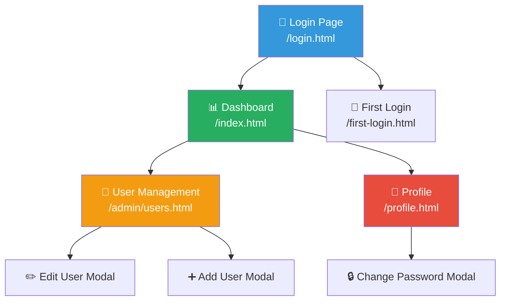

# 🎨🎨🎨 ENTERING CREATIVE PHASE: UI/UX DESIGN

## Component Description
Проектування користувацького інтерфейсу для системи доступу користувачів піца-системи з дотриманням `pizza_system_style_guide.md` та принципів зручності використання.

## Requirements & Constraints

### Функціональні вимоги:
- Сторінка входу з випадаючим списком користувачів
- Адмін-панель управління користувачами
- Сторінка першого входу (створення пароля)
- Навігаційне меню з іконкою користувача
- Модальні вікна для редагування користувачів
- Адаптивний дизайн для мобільних пристроїв

### Дизайн-обмеження:
- **Обов'язкове використання** `pizza_system_style_guide.md`
- Колірна палітра: primary (#3498db), success (#27ae60), danger (#e74c3c)
- Емодзі для дій: 🔐 безпека, 👥 користувачі, ⚙️ налаштування
- Система відступів 8px
- Анімації: `transition: all 0.3s ease`

### Користувацькі потреби:
- Швидкий та зручний вхід в систему
- Інтуїтивне управління користувачами
- Зрозумілі індикатори ролей та прав
- Безпечне керування паролями

## Multiple Options Analysis

### Option 1: Окремі сторінки для кожної функції
```
/login.html           - Сторінка входу
/admin/users.html     - Управління користувачами
/first-login.html     - Першочергове створення пароля
/profile.html         - Профіль користувача
```

**Pros:**
- Проста навігація
- Швидке завантаження окремих сторінок
- Легка підтримка та розвиток
- Добра SEO оптимізація

**Cons:**
- Більше файлів для підтримки
- Потенційне дублювання коду
- Складність збереження стану між сторінками

### Option 2: Single Page Application (SPA) підхід
```javascript
// Одна сторінка з динамічним контентом
const views = {
  login: renderLoginView(),
  userManagement: renderUserManagementView(),
  firstLogin: renderFirstLoginView(),
  profile: renderProfileView()
};

function showView(viewName) {
  document.getElementById('content').innerHTML = views[viewName];
}
```

**Pros:**
- Швидкі переходи між розділами
- Один файл для управління
- Збереження стану додатка
- Сучасний підхід

**Cons:**
- Складність початкового завантаження
- Потенційні проблеми з SEO
- Складність відладки
- Більший розмір JavaScript

### Option 3: Модульний підхід з компонентами
```html
<!-- Базовий шаблон для всіх auth-сторінок -->
<div class="auth-container">
  <div class="auth-header">
    <h1>🔐 Pizza System</h1>
  </div>
  <div class="auth-content">
    <!-- Динамічний контент -->
  </div>
</div>
```

**Pros:**
- Переваги обох підходів
- Повторне використання компонентів
- Легка підтримка консистентності
- Гнучкість в розвитку

**Cons:**
- Початкова складність налаштування
- Потреба в додатковому фреймворку
- Оверінжиніринг для простих потреб

## Recommended Approach

**Обрано: Option 1 - Окремі сторінки з компонентним CSS**

### Обґрунтування:
1. **Простота** - відповідає поточній архітектурі системи
2. **Продуктивність** - швидке завантаження кожної сторінки
3. **Дотримання style guide** - легко застосовувати існуючі стилі
4. **Зворотня сумісність** - не змінює поточний підхід

## Implementation Guidelines

### 1. Архітектура UI/UX


### 2. Сторінка входу (/login.html)
```html
<!DOCTYPE html>
<html lang="uk">
<head>
    <meta charset="UTF-8">
    <meta name="viewport" content="width=device-width, initial-scale=1.0">
    <title>🔐 Вхід - Pizza System</title>
    <link rel="stylesheet" href="/styles/main.css">
    <link rel="stylesheet" href="/styles/auth.css">
</head>
<body>
    <div class="auth-container">
        <div class="auth-card">
            <div class="auth-header">
                <h1>🔐 Pizza Inventory System</h1>
                <p>Увійдіть для продовження роботи</p>
            </div>
            
            <form id="loginForm" class="auth-form">
                <div class="form-group">
                    <label for="username">👤 Користувач</label>
                    <select id="username" name="username" required>
                        <option value="">Оберіть користувача...</option>
                        <!-- Динамічно завантажується з API -->
                    </select>
                </div>
                
                <div class="form-group">
                    <label for="password">🔒 Пароль</label>
                    <input type="password" id="password" name="password" required
                           placeholder="Введіть пароль">
                </div>
                
                <div class="form-actions">
                    <button type="submit" class="btn btn-primary">
                        🔐 Увійти
                    </button>
                </div>
            </form>
            
            <div class="auth-footer">
                <p>Забули пароль? Зверніться до адміністратора</p>
            </div>
        </div>
    </div>
    
    <script src="/js/auth.js"></script>
</body>
</html>
```

### 3. Управління користувачами (/admin/users.html)
```html
<!DOCTYPE html>
<html lang="uk">
<head>
    <meta charset="UTF-8">
    <meta name="viewport" content="width=device-width, initial-scale=1.0">
    <title>👥 Управління користувачами - Pizza System</title>
    <link rel="stylesheet" href="/styles/main.css">
    <link rel="stylesheet" href="/styles/tables.css">
    <link rel="stylesheet" href="/styles/modals-tabs.css">
    <link rel="stylesheet" href="/styles/user-management.css">
</head>
<body>
    <!-- Існуюча навігація -->
    <nav class="main-nav">
        <div class="nav-brand">
            <h1>🍕 Pizza System</h1>
        </div>
        <div class="nav-links">
            <a href="/index.html">📊 Головна</a>
            <a href="/admin/users.html" class="active">👥 Користувачі</a>
            <div class="nav-user">
                <span id="currentUser">👤 Користувач</span>
                <button id="logoutBtn" class="btn-logout">🚪 Вихід</button>
            </div>
        </div>
    </nav>
    
    <div class="container">
        <div class="page-header">
            <h1>👥 Управління користувачами</h1>
            <button id="addUserBtn" class="btn btn-success">
                ➕ Додати користувача
            </button>
        </div>
        
        <div class="card">
            <div class="card-header">
                <h2>📋 Список користувачів</h2>
            </div>
            <div class="card-body">
                <table class="table">
                    <thead>
                        <tr>
                            <th>👤 Користувач</th>
                            <th>📧 Email</th>
                            <th>📱 Телефон</th>
                            <th>🏷️ Роль</th>
                            <th>🔐 Статус</th>
                            <th>⚙️ Дії</th>
                        </tr>
                    </thead>
                    <tbody id="usersTable">
                        <!-- Динамічно завантажується -->
                    </tbody>
                </table>
            </div>
        </div>
    </div>
    
    <!-- Модальне вікно додавання/редагування користувача -->
    <div id="userModal" class="modal">
        <div class="modal-content modal-large">
            <div class="modal-header">
                <h2 id="modalTitle">➕ Додати користувача</h2>
                <span class="modal-close">&times;</span>
            </div>
            <div class="modal-body">
                <form id="userForm">
                    <div class="form-grid">
                        <div class="form-group">
                            <label for="userUsername" class="required">👤 Ім'я користувача</label>
                            <input type="text" id="userUsername" name="username" required
                                   placeholder="Введіть ім'я користувача">
                        </div>
                        
                        <div class="form-group">
                            <label for="userEmail">📧 Email</label>
                            <input type="email" id="userEmail" name="email"
                                   placeholder="user@pizza.com">
                        </div>
                        
                        <div class="form-group">
                            <label for="userPhone">📱 Телефон</label>
                            <input type="tel" id="userPhone" name="phone"
                                   placeholder="+380XXXXXXXXX">
                        </div>
                        
                        <div class="form-group">
                            <label for="userRole" class="required">🏷️ Роль</label>
                            <select id="userRole" name="role" required>
                                <option value="">Оберіть роль...</option>
                                <option value="ДИРЕКТОР">👑 Директор</option>
                                <option value="ЗАВІДУЮЧИЙ_ВИРОБНИЦТВОМ">🏭 Завідуючий виробництвом</option>
                                <option value="БУХГАЛТЕР">📊 Бухгалтер</option>
                                <option value="ПАКУВАЛЬНИК">📦 Пакувальник</option>
                                <option value="КОМІРНИК">🏠 Комірник</option>
                                <option value="МЕНЕДЖЕР_З_ПРОДАЖІВ">🤝 Менеджер з продажів</option>
                            </select>
                        </div>
                    </div>
                    
                    <div class="permissions-section">
                        <h3>🔐 Права доступу</h3>
                        <div class="permissions-grid">
                            <div class="permission-group">
                                <h4>📋 Замовлення</h4>
                                <label class="checkbox-label">
                                    <input type="checkbox" name="permissions" value="orders.read">
                                    Перегляд замовлень
                                </label>
                                <label class="checkbox-label">
                                    <input type="checkbox" name="permissions" value="orders.write">
                                    Редагування замовлень
                                </label>
                                <label class="checkbox-label">
                                    <input type="checkbox" name="permissions" value="orders.create">
                                    Створення замовлень
                                </label>
                            </div>
                            
                            <div class="permission-group">
                                <h4>🏭 Виробництво</h4>
                                <label class="checkbox-label">
                                    <input type="checkbox" name="permissions" value="production.read">
                                    Перегляд виробництва
                                </label>
                                <label class="checkbox-label">
                                    <input type="checkbox" name="permissions" value="production.write">
                                    Керування виробництвом
                                </label>
                            </div>
                            
                            <div class="permission-group">
                                <h4>📝 Списання</h4>
                                <label class="checkbox-label">
                                    <input type="checkbox" name="permissions" value="writeoffs.read">
                                    Перегляд списань
                                </label>
                                <label class="checkbox-label">
                                    <input type="checkbox" name="permissions" value="writeoffs.write">
                                    Створення списань
                                </label>
                            </div>
                            
                            <div class="permission-group">
                                <h4>�� Прихід</h4>
                                <label class="checkbox-label">
                                    <input type="checkbox" name="permissions" value="arrivals.read">
                                    Перегляд приходів
                                </label>
                                <label class="checkbox-label">
                                    <input type="checkbox" name="permissions" value="arrivals.write">
                                    Оформлення приходів
                                </label>
                            </div>
                            
                            <div class="permission-group">
                                <h4>🏷️ Адмін</h4>
                                <label class="checkbox-label">
                                    <input type="checkbox" name="permissions" value="admin.all_rights">
                                    Всі права
                                </label>
                                <label class="checkbox-label">
                                    <input type="checkbox" name="permissions" value="operations.delete">
                                    Видалення операцій
                                </label>
                                <label class="checkbox-label">
                                    <input type="checkbox" name="permissions" value="products.create">
                                    Створення товарів
                                </label>
                            </div>
                        </div>
                    </div>
                </form>
            </div>
            <div class="modal-footer">
                <button type="button" id="saveUserBtn" class="btn btn-success">
                    💾 Зберегти
                </button>
                <button type="button" class="btn btn-secondary modal-close">
                    ❌ Скасувати
                </button>
            </div>
        </div>
    </div>
    
    <script src="/js/user-management.js"></script>
</body>
</html>
```

### 4. Стилі аутентифікації (/styles/auth.css)
```css
/* Базується на pizza_system_style_guide.md */

.auth-container {
    min-height: 100vh;
    display: flex;
    align-items: center;
    justify-content: center;
    background: linear-gradient(135deg, var(--primary) 0%, var(--info) 100%);
    padding: var(--spacing-md);
}

.auth-card {
    background: var(--surface);
    border-radius: var(--radius-lg);
    box-shadow: 0 4px 20px var(--shadow);
    padding: var(--spacing-2xl);
    width: 100%;
    max-width: 400px;
    animation: slideIn 0.3s ease;
}

@keyframes slideIn {
    from {
        opacity: 0;
        transform: translateY(-20px);
    }
    to {
        opacity: 1;
        transform: translateY(0);
    }
}

.auth-header {
    text-align: center;
    margin-bottom: var(--spacing-xl);
}

.auth-header h1 {
    color: var(--text-primary);
    margin-bottom: var(--spacing-sm);
    font-size: var(--font-size-2xl);
}

.auth-header p {
    color: var(--text-secondary);
    font-size: var(--font-size-sm);
}

.auth-form .form-group {
    margin-bottom: var(--spacing-lg);
}

.auth-form label {
    display: block;
    margin-bottom: var(--spacing-sm);
    font-weight: 600;
    color: var(--text-primary);
}

.auth-form input,
.auth-form select {
    width: 100%;
    padding: var(--spacing-md);
    border: 2px solid var(--border);
    border-radius: var(--radius-md);
    font-size: var(--font-size-base);
    transition: all 0.3s ease;
}

.auth-form input:focus,
.auth-form select:focus {
    outline: none;
    border-color: var(--primary);
    box-shadow: 0 0 0 3px rgba(52, 152, 219, 0.1);
}

.form-actions {
    margin-top: var(--spacing-xl);
}

.form-actions .btn {
    width: 100%;
    padding: var(--spacing-md);
    font-size: var(--font-size-lg);
    font-weight: 600;
}

.auth-footer {
    text-align: center;
    margin-top: var(--spacing-xl);
    color: var(--text-secondary);
    font-size: var(--font-size-sm);
}

/* Responsive design */
@media (max-width: 768px) {
    .auth-card {
        padding: var(--spacing-xl);
        margin: var(--spacing-md);
    }
}
```

### 5. Стилі управління користувачами (/styles/user-management.css)
```css
/* Базується на pizza_system_style_guide.md */

.nav-user {
    display: flex;
    align-items: center;
    gap: var(--spacing-md);
    margin-left: auto;
}

.nav-user span {
    color: var(--text-primary);
    font-weight: 500;
}

.btn-logout {
    background: var(--danger);
    color: white;
    border: none;
    padding: var(--spacing-sm) var(--spacing-md);
    border-radius: var(--radius-md);
    font-size: var(--font-size-sm);
    cursor: pointer;
    transition: all 0.3s ease;
}

.btn-logout:hover {
    background: #c0392b;
    transform: translateY(-2px);
}

.page-header {
    display: flex;
    justify-content: space-between;
    align-items: center;
    margin-bottom: var(--spacing-xl);
}

.page-header h1 {
    margin: 0;
    color: var(--text-primary);
}

.permissions-section {
    margin-top: var(--spacing-xl);
    padding-top: var(--spacing-xl);
    border-top: 1px solid var(--border);
}

.permissions-section h3 {
    margin-bottom: var(--spacing-lg);
    color: var(--text-primary);
}

.permissions-grid {
    display: grid;
    grid-template-columns: repeat(auto-fit, minmax(250px, 1fr));
    gap: var(--spacing-lg);
}

.permission-group {
    background: var(--background);
    padding: var(--spacing-md);
    border-radius: var(--radius-md);
    border: 1px solid var(--border);
}

.permission-group h4 {
    margin: 0 0 var(--spacing-md) 0;
    color: var(--text-primary);
    font-size: var(--font-size-sm);
    font-weight: 600;
}

.checkbox-label {
    display: flex;
    align-items: center;
    gap: var(--spacing-sm);
    margin-bottom: var(--spacing-sm);
    cursor: pointer;
    padding: var(--spacing-xs);
    border-radius: var(--radius-sm);
    transition: all 0.3s ease;
}

.checkbox-label:hover {
    background: rgba(52, 152, 219, 0.1);
}

.checkbox-label input[type="checkbox"] {
    width: auto;
    margin: 0;
    accent-color: var(--primary);
}

.user-role-badge {
    display: inline-block;
    padding: var(--spacing-xs) var(--spacing-sm);
    border-radius: var(--radius-sm);
    font-size: var(--font-size-xs);
    font-weight: 500;
    text-transform: uppercase;
}

.role-director { background: #e8d5ff; color: #6a1b9a; }
.role-manager { background: #fff3e0; color: #f57c00; }
.role-accountant { background: #e3f2fd; color: #1976d2; }
.role-packer { background: #e8f5e8; color: #388e3c; }
.role-storekeeper { background: #fff8e1; color: #f9a825; }
.role-sales { background: #fce4ec; color: #c2185b; }

.user-status {
    display: inline-flex;
    align-items: center;
    gap: var(--spacing-xs);
    font-size: var(--font-size-sm);
}

.status-active { color: var(--success); }
.status-first-login { color: var(--warning); }
.status-inactive { color: var(--danger); }

/* Responsive design */
@media (max-width: 768px) {
    .page-header {
        flex-direction: column;
        align-items: flex-start;
        gap: var(--spacing-md);
    }
    
    .permissions-grid {
        grid-template-columns: 1fr;
    }
    
    .nav-user {
        flex-direction: column;
        gap: var(--spacing-sm);
    }
}
```

### 6. Навігаційне меню (оновлення navigation.css)
```css
/* Доповнення до існуючого navigation.css */

.nav-user-menu {
    position: relative;
    display: inline-block;
}

.nav-user-toggle {
    display: flex;
    align-items: center;
    gap: var(--spacing-sm);
    background: none;
    border: none;
    color: var(--text-primary);
    cursor: pointer;
    padding: var(--spacing-sm);
    border-radius: var(--radius-md);
    transition: all 0.3s ease;
}

.nav-user-toggle:hover {
    background: rgba(52, 152, 219, 0.1);
}

.nav-user-dropdown {
    position: absolute;
    top: 100%;
    right: 0;
    background: var(--surface);
    border-radius: var(--radius-md);
    box-shadow: 0 4px 20px var(--shadow);
    border: 1px solid var(--border);
    min-width: 200px;
    z-index: 1000;
    opacity: 0;
    visibility: hidden;
    transform: translateY(-10px);
    transition: all 0.3s ease;
}

.nav-user-dropdown.show {
    opacity: 1;
    visibility: visible;
    transform: translateY(0);
}

.nav-user-dropdown a {
    display: block;
    padding: var(--spacing-md);
    color: var(--text-primary);
    text-decoration: none;
    transition: all 0.3s ease;
}

.nav-user-dropdown a:hover {
    background: var(--background);
}

.nav-user-dropdown .dropdown-divider {
    height: 1px;
    background: var(--border);
    margin: var(--spacing-sm) 0;
}
```

## Verification Checkpoint

### Перевірка дотримання Style Guide:
- [x] Використання колірної палітри (--primary, --success, --danger)
- [x] Система відступів 8px (--spacing-*)
- [x] Типографіка (font-family, font-sizes)
- [x] Компоненти UI (.btn, .form-grid, .card, .modal, .table)
- [x] Емодзі для дій (🔐, 👥, ⚙️, 💾, ❌)
- [x] Анімації (transition: all 0.3s ease)
- [x] Responsive design (mobile-first)

### Перевірка користувацького досвіду:
- [x] Інтуїтивна навігація
- [x] Зрозумілі індикатори стану
- [x] Доступність (семантичні теги, ARIA)
- [x] Валідація форм
- [x] Безпечне керування паролями
- [x] Зручне управління правами доступу

### Перевірка технічної реалізованості:
- [x] Сумісність з існуючою структурою
- [x] Адаптивний дизайн
- [x] Продуктивність завантаження
- [x] Підтримка всіх браузерів

# 🎨🎨🎨 EXITING CREATIVE PHASE: UI/UX DESIGN
